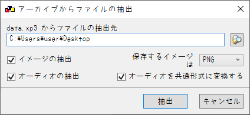
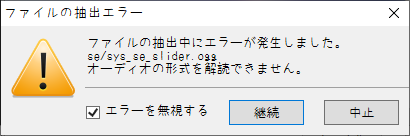

# KIRIKIRI2ONS_Moviendo-otomec

## なにこれ
  2011年にMoviendo様から発売された、18禁PC向けノベルゲーム'[処女回路](https://web.archive.org/web/20160730000957fw_/http://www.moviendo-soft.com:80/otm_s/top.php)'を<br>
  ONScripter形式へ変換するためのコンバータです<br>

## 再現度
原作との主な違いは以下
 - セーブ/ロード画面は超簡略化

## 使い方
※先に[修正パッチ](https://web.archive.org/web/20160923014453fw_/http://lapislazuli-svr.sakura.ne.jp/movi_d/otm_rev_1_1.zip)を当てておいてください
 1. 適当な作業フォルダを作成
 2. [GARBro](https://drive.google.com/file/d/1gH9nNRxaz8GexN0B1hWyUc3o692bkWXX/view)でdata.xp3を作業フォルダへ展開<br>

     設定は以下の通り↓<br>
     

     エラーが出ると思いますが無視してください↓<br>
     

 3. 展開先のディレクトリで[このコンバータ](https://github.com/Prince-of-sea/KIRIKIRI2ONS_Moviendo-otomec/releases/latest)をDL/起動させ変換(一瞬で終わります)<br>
    変換前の時点で以下のような構成になっていればOKです↓<br>
```
```
 4. ウィンドウが消え、0.txtができれば完成<br>
    exe等の不要データを削除し、変換済みファイルと共に利用ハードへ転送

## 注意事項
 - 当然ですが公式ツールではありません
 - __パッケージ版で動作確認しています__ その他の動作は未確認
 - 本ツールの使用において生じた問題や不利益などについて、作者は一切の責任を負いません
 - 制作サークル様に迷惑をかけたくないので、<br>
   本ツールのSNS等での拡散は**ご遠慮ください**<br>
   ~~(拡散されるほどのツールでもない気はするが一応)~~<br>

## その他
本作の変換を追加でサポートする[PSP向け自動変換ツール作ってます](https://github.com/Prince-of-sea/ONScripter_Multi_Converter)<br>
もしPSPで遊ぶ場合はぜひご利用ください(v1.4.8以上推奨)